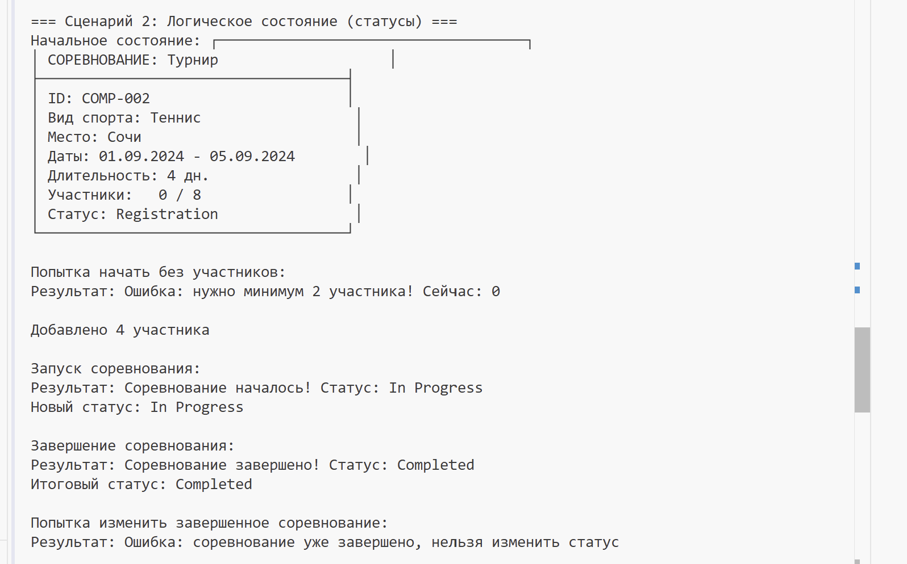
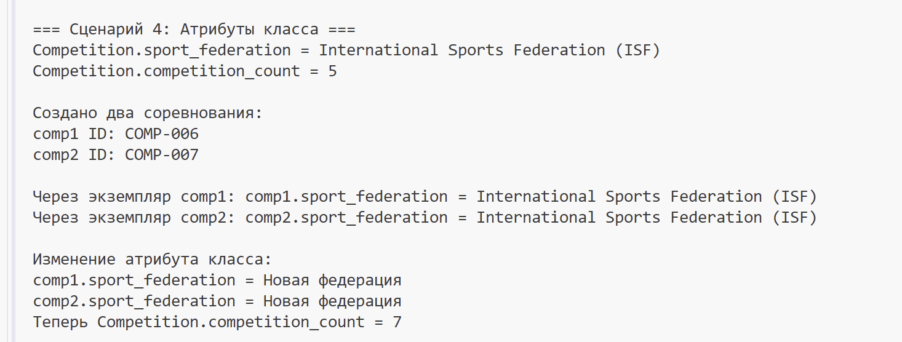
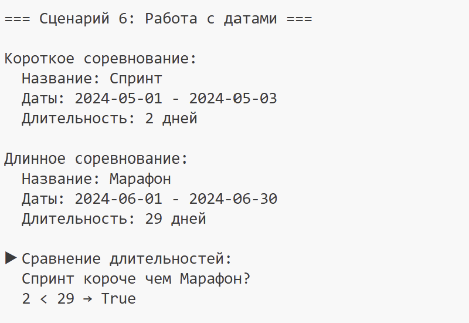
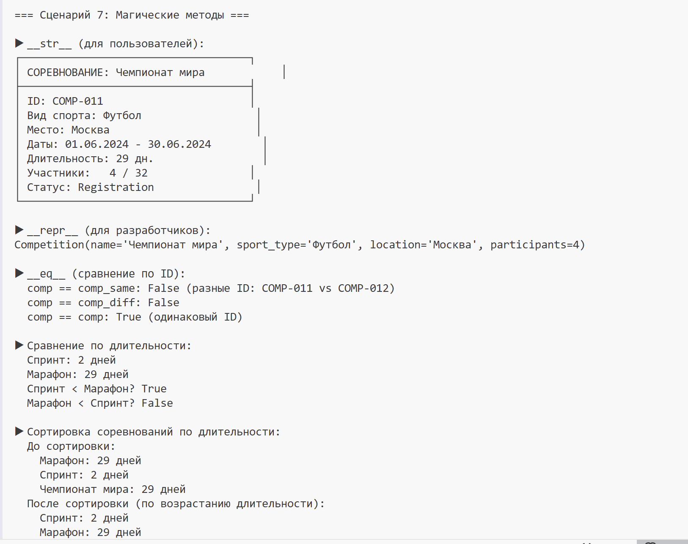

# Лабораторная работа-1 — Класс и инкапсуляция (Python 3.x)

## Цель работы

* Освоить объявление пользовательских классов.
* Разобраться с инкапсуляцией (атрибуты экземпляра, закрытые поля).
* Реализовать свойства (`@property`).
* Переопределить магические методы (`__str__`, `__repr__`, `__eq__`).
* Осознать разницу между атрибутами класса и экземпляра.

## 7. Фитнес / Спорт

### Класс:
* Competition
 
 
### Атрибуты класса:

sport_federation — название федерации спорта

competition_count — счетчик для генерации ID соревнований

Закрытые поля:

_name — название соревнования

_sport_type — вид спорта

_location — место проведения

_start_date — дата начала

_end_date — дата окончания

_max_participants — максимальное количество участников

_status — статус соревнования

_participants — список участников

_results — результаты соревнования

_min_participants — минимальное количество участников для проведения

_competition_id — ID соревнования

### Свойства @property:

Чтение: name — название соревнования

Чтение: sport_type — вид спорта

Чтение и запись: location — место проведения

Чтение: start_date — дата начала

Чтение: end_date — дата окончания

Чтение: max_participants — максимальное количество участников

Чтение: status — статус соревнования

Чтение: participants — список участников

Чтение: competition_id — ID соревнования

Чтение: participants_count — количество участников

Чтение и запись: min_participants — минимальное количество участников

Вычисляемое: get_competition_duration() — длительность соревнования в днях

### Магические методы:

str — для print (читаемое описание в виде таблички)

repr — для разработчиков (информация для отладки)

eq — сравнение по ID соревнования

### Бизнес-методы:

get_participants_list() — получение форматированного списка участников

get_competition_duration() — расчет длительности соревнования в днях

next_status() — переход к следующему статусу с проверкой возможности

## Сценарий 1: Валидация данных

Здесь происходит обработка ошибок.Например,пустое название соревнования, цифры в названии вида спорта, смесь языков в названии вида спорта (например, "footballфутбол"),пустая локация. Если при обработке, программа находит ошибку, в терменале выводится это и тип ошибки.
 
 ## Сценарий 2: Логическое состояние (статусы)

В этом сценарии демонстрируется жизненный цикл соревнования через изменение его статуса:

Начальное состояние: Создается турнир "Турнир" (теннис, Сочи, 8 участников). Соревнование получает статус "Registration" и уникальный ID COMP-002. На этом этапе идет регистрация участников.

Попытка начала без участников: Соревнование пытаются перевести в следующий статус ("In Progress"), но система проверяет условие — для начала нужно минимум 2 участника. Так как участников 0, операция блокируется с ошибкой "нужно минимум 2 участника! Сейчас: 0". Это демонстрирует защиту от некорректных переходов.

Добавление участников: В соревнование добавляются 4 участника. Теперь условие для старта выполнено.

Запуск соревнования: Повторная попытка перехода в следующий статус — на этот раз успешная. Статус меняется на "In Progress" (сореввание началось, идет процесс).

Завершение соревнования: Соревнование переводят в следующий статус — "Completed" (завершено). Это финальная стадия.

Попытка изменения завершенного соревнования: После того как соревнование завершено, система блокирует любые дальнейшие попытки изменить статус, выдавая ошибку "соревнование уже завершено, нельзя изменить статус". Это демонстрирует, что объект перешел в терминальное состояние и больше не подлежит изменениям.

## Сценарий 3: Сравнение и независимость

Сценарий 3: Сравнение и независимость объектов

В этом сценарии демонстрируется, как объекты класса Competition существуют независимо друг от друга и как работает сравнение по ID:

Создание трех соревнований:

Создается "Кубок" (баскетбол, Саратов) → получает ID COMP-003

Создается второй "Кубок" с точно такими же параметрами → получает ID COMP-004

Создается "Чемпионат" (хоккей, Казань) → получает ID COMP-005

Сравнение объектов:

COMP-003 и COMP-004 сравниваются через eq → результат False, потому что у них разные ID, хотя все остальные параметры совпадают

COMP-003 и COMP-005 сравниваются → тоже False, так как разные ID и разные параметры

Независимость объектов:

В COMP-004 добавляется один участник

COMP-003 при этом остается без изменений (участников: 0)

COMP-004 теперь имеет участников: 1

Повторное сравнение после изменения → всё равно False, так как ID не меняются в течение жизни объекта

Этот сценарий показывает, что каждый объект живет своей жизнью, изменения в одном не влияют на другие, а сравнение происходит только по уникальному идентификатору.

## Сценарий 4: Атрибуты класса

В этом сценарии демонстрируется работа с атрибутами класса, которые являются общими для всех экземпляров:

Начальное состояние атрибутов класса:

sport_federation = "International Sports Federation (ISF)" — общее название федерации для всех соревнований

competition_count = 5 — счетчик показывает, что уже создано 5 соревнований (COMP-001 до COMP-005)

Создание новых экземпляров:

Создается "Турнир1" (бокс, Москва) → получает ID COMP-006

Создается "Турнир2" (теннис, Сочи) → получает ID COMP-007

Счетчик competition_count увеличивается до 7

Доступ к атрибутам класса через экземпляры:

comp1.sport_federation → показывает "International Sports Federation (ISF)"

comp2.sport_federation → показывает то же самое значение

Изменение атрибута класса:

Через класс меняем значение: Competition.sport_federation = "Новая федерация"

После изменения оба экземпляра (comp1 и comp2) начинают показывать "Новая федерация"

Этот сценарий демонстрирует, что атрибуты класса являются общими для всех объектов — изменение через класс или любой экземпляр влияет на все существующие объекты.

## Сценарий 5: Множественные состояния
 

В этом сценарии демонстрируется полный жизненный цикл соревнования с проверкой всех состояний и ограничений:

Создание соревнования:

Создается "Чемпионат" (баскетбол, Краснодар, 01.10.2024-07.10.2024, 8 участников) → получает ID COMP-008

Начальный статус: Registration

Состояние 1: Registration (недостаточно участников)

Участников: 0, минимально требуется: 2

Попытка перейти в следующий статус → система проверяет условие и возвращает ошибку "нужно минимум 2 участника! Сейчас: 0"

Соревнование остается в статусе Registration, продолжается регистрация

Состояние 2: Registration (достаточно участников)

Добавляются 4 участника: Игрок1, Игрок2, Игрок3, Игрок4

Теперь участников: 4, условие для старта выполнено

Запуск соревнования → статус успешно меняется на "In Progress"

Состояние 3: In Progress (соревнование идет)

Статус: In Progress

Список участников зафиксирован

Соревнование завершается → статус меняется на "Completed"

Состояние 4: Completed (завершено)

Статус: Completed — терминальное состояние

Попытка снова изменить статус → система блокирует с ошибкой "соревнование уже завершено, нельзя изменить статус"

Проверка валидации перехода статусов:

Отдельно проверяется функция validate_status_transition

Попытка перейти из "Completed" в "Registration" → вызывает ошибку "Невозможно перейти из статуса 'Completed' в статус 'Registration'"

Это подтверждает, что правила переходов жестко заданы и соблюдаются

Этот сценарий показывает полный жизненный цикл объекта: регистрация → набор участников → старт → проведение → завершение, с проверкой всех ограничений на каждом этапе.

## Сценарий 6: Работа с датами

В этом сценарии демонстрируется работа с временными промежутками и вычисляемыми свойствами:

• Создание короткого соревнования "Спринт" (бег, Москва, 01.05.2024-03.05.2024) → длительность 3 дня
• Создание длинного соревнования "Марафон" (бег, Москва, 01.06.2024-30.06.2024) → длительность 30 дней
• Расчет длительности через бизнес-метод get_competition_duration()
• Демонстрируется, что длительность вычисляется автоматически на основе дат начала и окончани

## Сценарий 7: Магические методы

В этом сценарии показано, что наши объекты можно выводить, сравнивать и использовать как встроенные типы Python:

str (пользовательский вывод):
• Создается соревнование "Чемпионат мира" (футбол, Москва, 32 участника)
• Добавляются участники: Россия, Бразилия, Германия, Аргентина
• Выводится результат print(comp)
• На экране появляется красивая табличка с информацией о соревновании в рамке
• Это метод, который вызывается, когда объект нужно показать пользователю

repr (отладочный вывод):
• Выводится результат repr(comp)
• Появляется строка типа Competition(name='Чемпионат мира', sport_type='футбол', location='Москва', participants=4)
• Это представление для отладки, показывающее состояние объекта и как его можно воссоздать

eq (сравнение соревнований):
• Сравниваем два соревнования с одинаковыми параметрами, но разными ID
• Результат: False (считаются разными, так как ID отличаются)
• Сравниваем соревнование с самим собой → True

Сортировка по длительности:
• Создаем короткое соревнование (3 дня) и длинное (30 дней)
• Сравниваем их по длительности через get_competition_duration()
• Демонстрируется, что соревнования можно сравнивать по различным характеристикам

Показано, что объекты класса Competition можно выводить в читаемом виде, отлаживать через repr, сравнивать по ID и сортировать по разным критериям как встроенные типы Python.