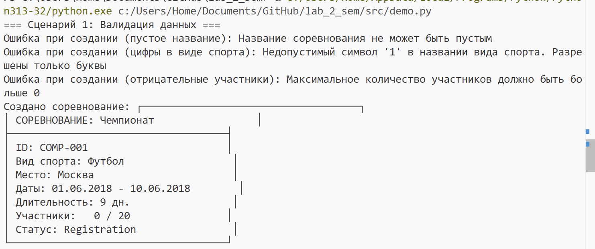
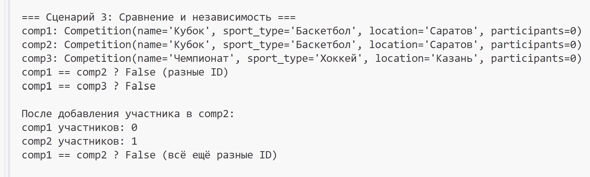
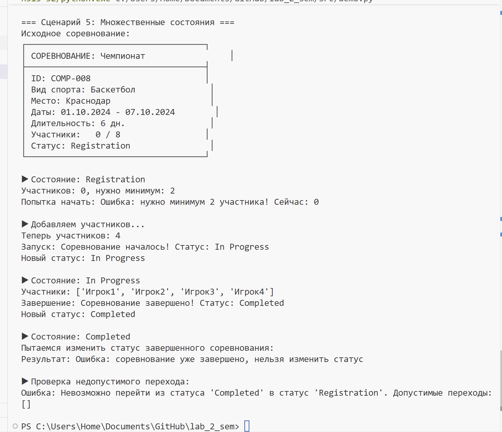

# Лабораторная работа №1: Система управления соревнованиями 

## Цель работы

- Освоить объявление пользовательских классов
- Разобраться с инкапсуляцией (закрытые поля)
- Реализовать свойства (`@property`)
- Переопределить магические методы (`__str__`, `__repr__`, `__eq__`)
- Понять разницу между атрибутами класса и экземпляра

## Реализованный класс

**Competition**

## Атрибуты класса:

sport_federation — название спортивной федерации

competition_count — счетчик для генерации ID соревнований

Закрытые поля:

_name — название соревнования

_sport_type — вид спорта

_location — место проведения

_start_date — дата начала

_end_date — дата окончания

_max_participants — максимальное количество участников

_status — статус соревнования

_participants — список участников

_results — результаты соревнования

_min_participants — минимальное количество участников

_competition_id — уникальный ID соревнования

## Свойства @property:

 name — название соревнования

 sport_type — вид спорта

location — место проведения

start_date — дата начала

end_date — дата окончания

max_participants — максимальное количество участников

status — статус соревнования

participants — список участников (копия)

competition_id — ID соревнования

participants_count — количество участников

min_participants — минимальное количество участников

get_competition_duration() — длительность соревнования в днях

## Магические методы:

__str__ — для print (читаемое описание с красивой рамкой)

__repr__ — для разработчиков

__eq__ — сравнение по ID соревнования

## Бизнес-методы:

get_participants_list() — получение форматированного списка участников

get_competition_duration() — расчет длительности в днях

next_status() — переход к следующему статусу (с проверкой условий)

# Демонтрация работы 
## Сценарий 1

## Сценарий 2

## Сценарий 3

## Сценарий 4

## Сценарий 5

## Сценарий 6

## Сценарий 7
