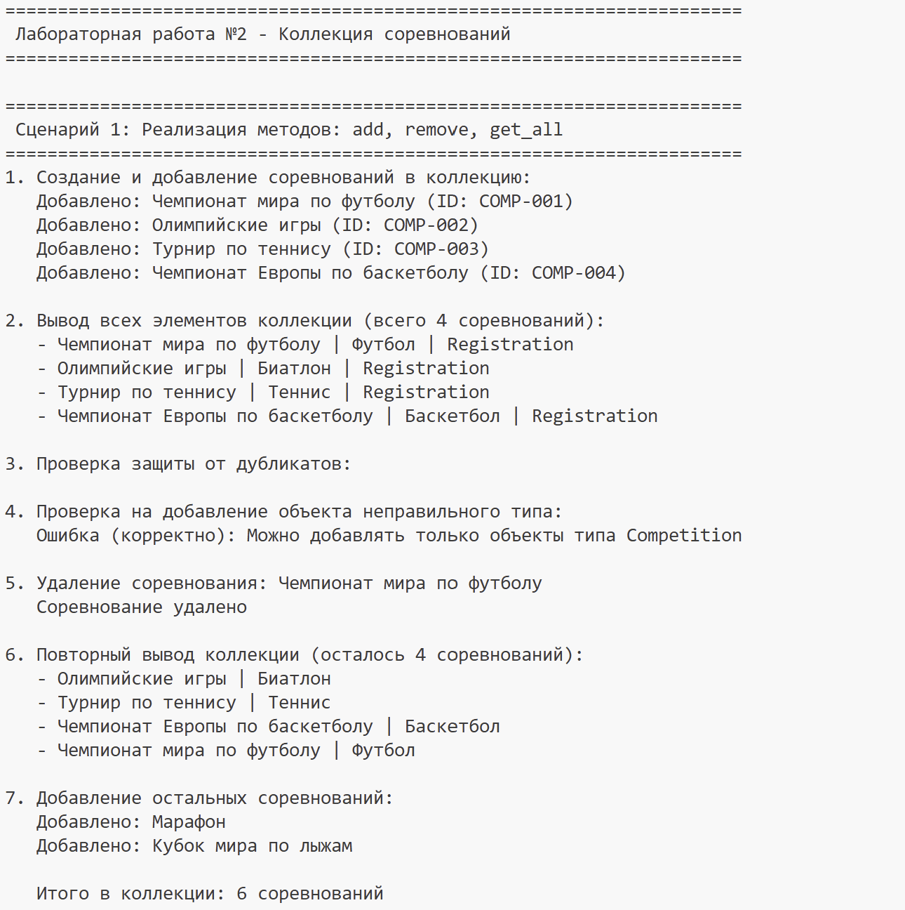
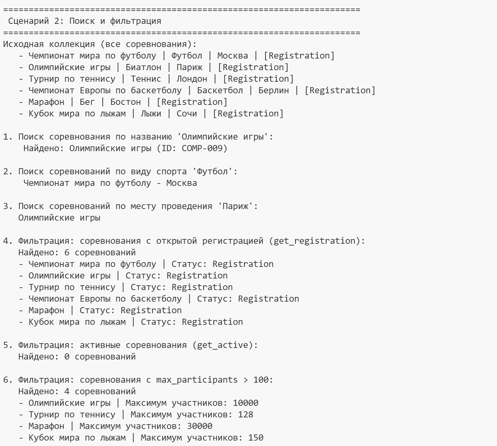
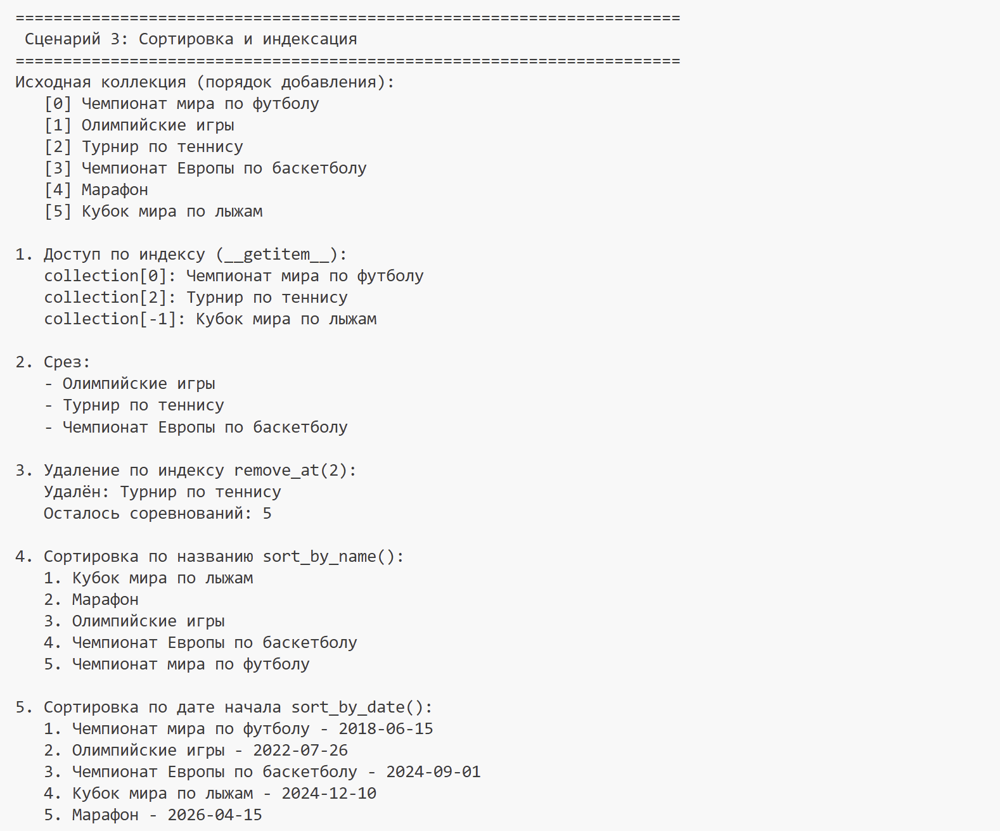
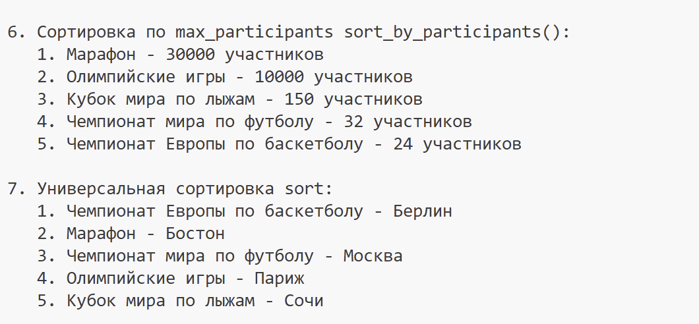

# ЛР-2 — Коллекция объектов (Python 3.x)

## Цель работы
1)Научиться работать с коллекциями объектов.
2)Понять разницу между моделью сущности и контейнером объектов.
3)Реализовать собственный контейнерный класс.
4)Освоить итерацию по объектам.
5)Реализовать базовые операции управления коллекцией.

## вариант 7: спорт и фитнесс
Класс: Competition
Класс коллекции: CompetitionCollection

## Краткое описание класса
CompetitionCollection — это контейнерный класс для управления коллекцией соревнований. Внутри хранит список объектов Competition.

## Методы коллекции

### Базовые операции

| Метод | Описание |
|-------|----------|
| `add(competition)` | Добавить соревнование в коллекцию |
| `remove(competition)` | Удалить соревнование из коллекции |
| `remove_at(index)` | Удалить соревнование по индексу |
| `get_all()` | Получить список всех соревнований |

### Поиск

| Метод | Описание |
|-------|----------|
| `find_by_id(competition_id)` | Поиск соревнования по ID |
| `find_by_name(name)` | Поиск соревнований по названию |
| `find_by_sport_type(sport_type)` | Поиск соревнований по виду спорта |
| `find_by_location(location)` | Поиск соревнований по месту проведения |
| `find_by_status(status)` | Поиск соревнований по статусу |

### Магические методы

| Метод | Описание |
|-------|----------|
| `__len__` | Получение количества соревнований |
| `__iter__` | Итерация по коллекции |
| `__getitem__` | Доступ по индексу и срезам |
| `__str__` | Строковое представление |
| `__repr__` | Представление для отладки |

### Сортировка

| Метод | Описание |
|-------|----------|
| `sort_by_name(reverse)` | Сортировка по названию |
| `sort_by_date(reverse)` | Сортировка по дате начала |
| `sort_by_duration(reverse)` | Сортировка по длительности |
| `sort_by_participants(reverse)` | Сортировка по максимальному количеству участников |
| `sort(key, reverse)` | Универсальная сортировка с пользовательским ключом |

### Фильтрация (возвращают новую коллекцию)

| Метод | Описание |
|-------|----------|
| `get_active()` | Получить активные соревнования (статус "In Progress") |
| `get_registration()` | Получить соревнования с открытой регистрацией (статус "Registration") |
| `get_completed()` | Получить завершённые соревнования (статус "Completed") |
| `get_long_duration(min_participants)` | Получить соревнования с max_participants > заданного значения |
    

## Демонстрация работы 

### Сценарий 1: Базовые операции (add,remove,get_all) 
- Создание объектов Competition
- Добавление элементов в коллекцию
- Вывод всех элементов 
- Использование len()
- Проверка защиты от дубликатов
- Проверка на добавление объекта неправильного типа
- Удаление элемента
- Повторный вывод коллекции
 

### Сценарий 2: Поиск и фильтрация

Демонстрирует:
- Поиск по названию (find_by_name)
- Поиск по виду спорта (find_by_sport_type)
- Поиск по месту проведения (find_by_location)
- Фильтрация по статусу (get_registration, get_active)
- Фильтрация по максимальному количеству участников

### Сценарий 3: Сортировка и индексация

Демонстрирует:
- Доступ по индексу (__getitem__)
- Срезы коллекции
- Удаление по индексу (remove_at)
- Сортировка по названию (sort_by_name)
- Сортировка по дате (sort_by_date)
- Сортировка по участникам (sort_by_participants)
- Универсальная сортировка (sort)

