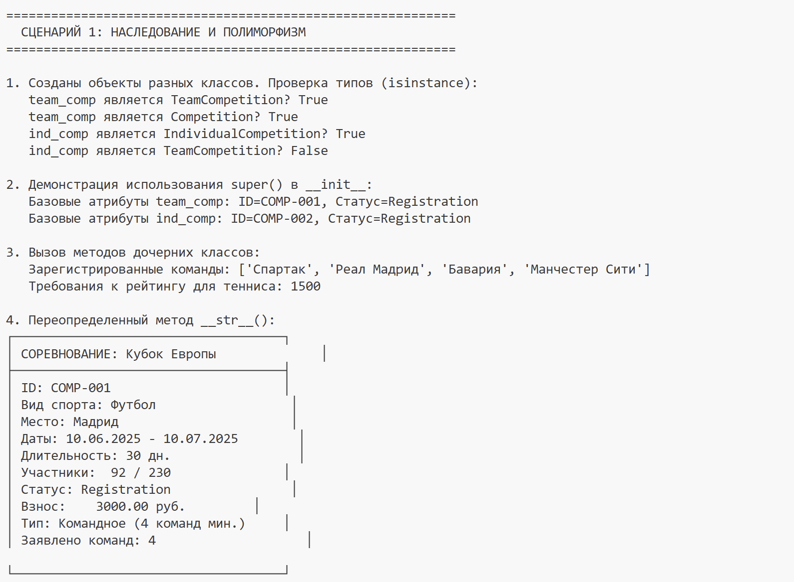
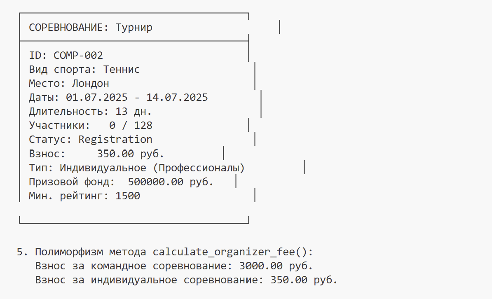
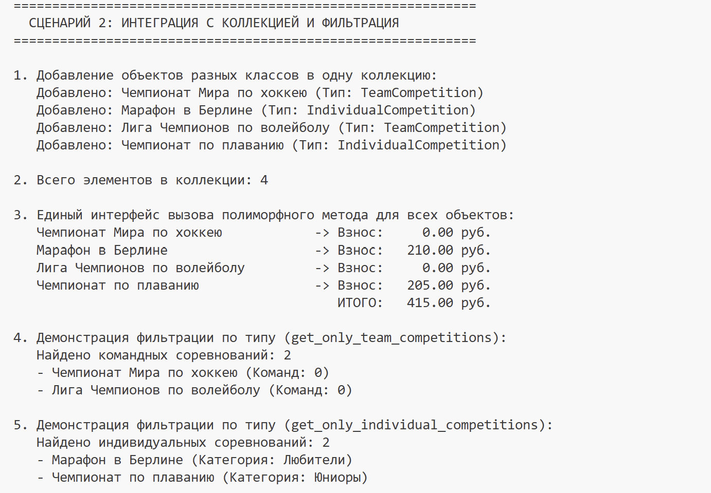
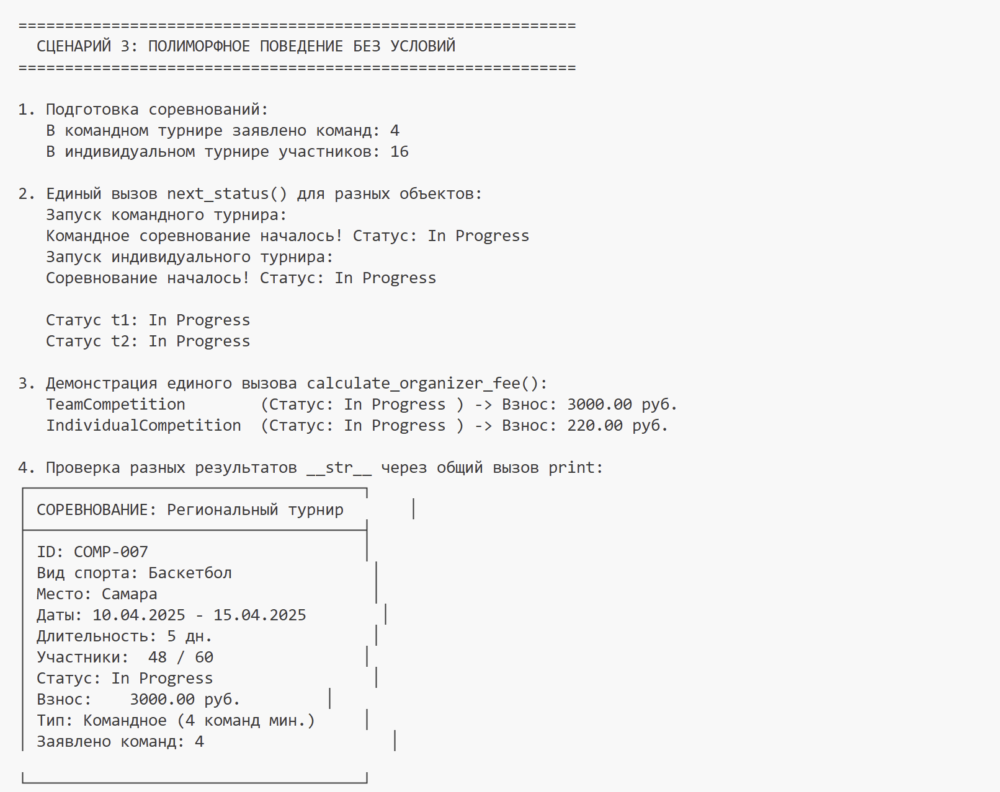
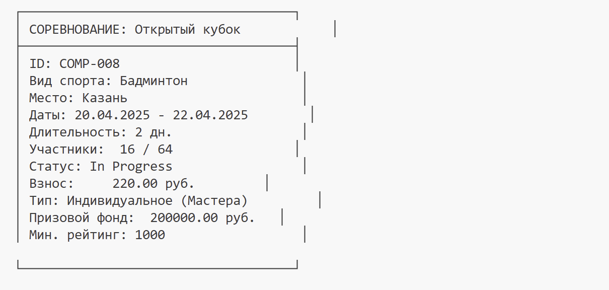

# Лабораторная работа №3 — Наследование и иерархия классов

## Цель работы

* Освоить механизм **наследования классов**.
* Научиться строить **иерархию объектов**.
* Понять разницу между:
  * базовым классом
  * производным классом
* Научиться **переиспользовать код**.
* Освоить **переопределение методов**.

### Базовый класс `Competition`
**Атрибуты:**
- `_name` — название соревнования
- `_sport_type` — вид спорта
- `_location` — место проведения
- `_start_date` — дата начала
- `_end_date` — дата окончания
- `_max_participants` — максимальное количество участников
- `_status` — статус (Registration/In Progress/Completed/Cancelled)
- `_participants` — список участников
- `_min_participants` — минимальное количество участников
- `_competition_id` — уникальный идентификатор

**Методы:**
- `get_participants_list()` — получение списка участников
- `get_competition_duration()` — расчёт длительности в днях
- `next_status()` — переход к следующему статусу
- `calculate_organizer_fee()` — расчёт организационного взноса (полиморфный)
- `__str__()` — строковое представление
- `__repr__()` — отладочное представление
- `__eq__()` — сравнение по ID

### Дочерний класс `TeamCompetition` (Командные соревнования)
**Атрибуты:**
- `_min_teams` — минимальное количество команд
- `_team_size` — размер команды
- `_registered_teams` — список зарегистрированных команд

**Методы:**
- `register_team()` — регистрация новой команды
- `get_teams_list()` — получение списка команд
- `min_teams` — свойство для получения минимального количества команд
- `team_size` — свойство для получения размера команды

**Переопределённые методы:**
- `__str__()` — добавляет информацию о командах и типе соревнования
- `next_status()` — проверяет минимальное количество команд перед запуском
- `calculate_organizer_fee()` — рассчитывается как: базовая ставка × количество команд × 1.5

### Дочерний класс `IndividualCompetition` (Индивидуальные соревнования)
**Атрибуты:**
- `_category` — категория участников (Профессионалы/Любители/Юниоры)
- `_prize_fund` — призовой фонд
- `_rating_required` — минимальный рейтинг для участия

**Методы:**
- `set_rating_requirement()` — установка требования к рейтингу
- `get_rating_requirement()` — получение требования к рейтингу
- `category` — свойство для получения категории
- `prize_fund` — свойство для получения призового фонда

**Переопределённые методы:**
- `__str__()` — добавляет информацию о категории, призовом фонде и рейтинге
- `calculate_organizer_fee()` — рассчитывается как: базовый взнос × коэффициент рейтинга + коэффициент призового фонда

### Класс `CompetitionCollection` (Коллекция соревнований)
**Методы:**
- `add()` — добавление соревнования
- `find_by_id()` — поиск по ID
- `get_all()` — получение всех элементов
- `filter_by_type()` — фильтрация по типу соревнования
- `get_only_team_competitions()` — получение только командных соревнований
- `get_only_individual_competitions()` — получение только индивидуальных соревнований
- `__len__()` — количество элементов
- `__iter__()` — итератор

### Различия между классами

| Класс | Тип | Участники | Особенности | Расчёт взноса |
|-------|-----|-----------|-------------|---------------|
| Competition | Базовый | Индивидуальные | Базовый функционал | 0 ₽ |
| TeamCompetition | Командный | Команды | Регистрация команд, проверка мин. команд | 500 × команды × 1.5 |
| IndividualCompetition | Индивидуальный | Одиночные | Категории, рейтинг, призовой фонд | 200 × рейтинг/1000 + фонд/10000 |

## 3. Демонстрация работы

### Сценарий 1: Наследование и полиморфизм
  

### Сценарий 2: Интеграция с коллекцией и фильтрация

### Сценарий 3: Полиморфное поведение без условий

