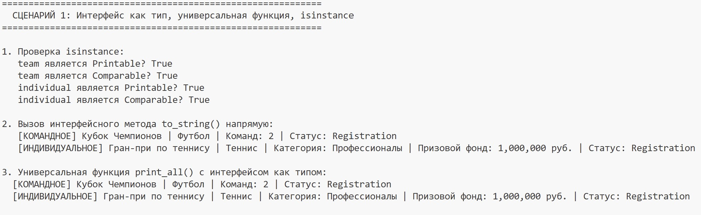
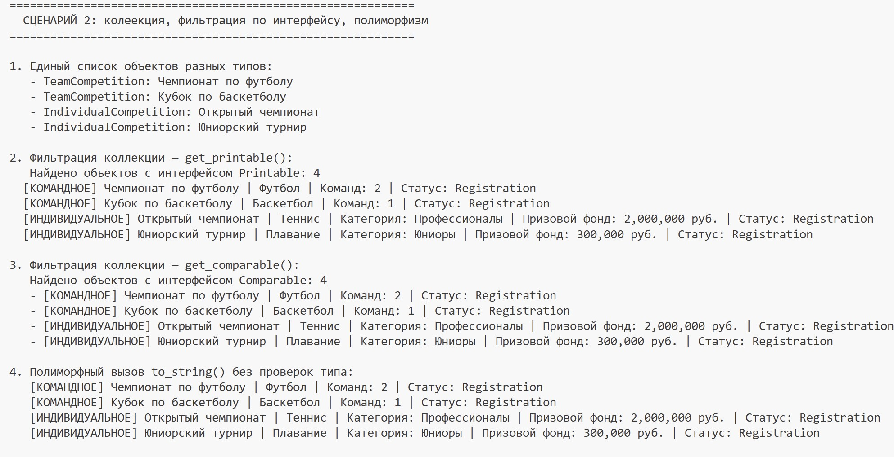
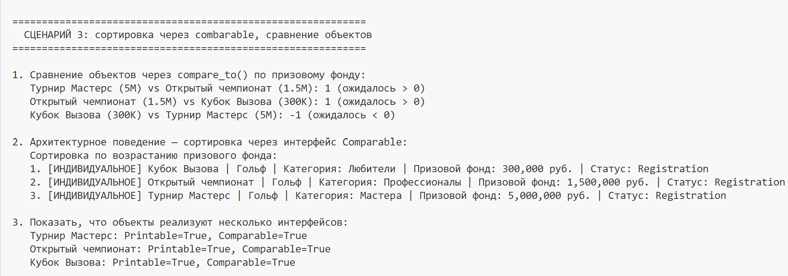

# Лабораторная работа-4: Интерфейсы и абстрактные классы

## Цель работы
Изучить:
- Познакомиться с абстрактными базовыми классами (ABC).
- Освоить понятие интерфейса (контракта поведения).
- Научиться задавать обязательные методы для классов.
- Закрепить полиморфизм через единый интерфейс.
- Научиться проектировать архитектуру, а не просто классы.
## Созданные интерфейсы

### 1. Printable
Метод `to_string()` - возвращает краткое строковое представление объекта:
- TeamCompetition: выводит тип, название, вид спорта, количество команд и статус
- IndividualCompetition: выводит тип, название, вид спорта, категорию, призовой фонд и статус

### 2. Comparable  
Метод `compare_to(other)` - сравнивает объекты:
- `-1` если текущий меньше
- `0` если равны
- `1` если текущий больше
- TeamCompetition: сравнивает по количеству зарегистрированных команд
- IndividualCompetition: сравнивает по призовому фонду

## Реализация в классах

| Класс | Printable | Comparable | Критерий сравнения |
|-------|-----------|------------|---------------------|
| TeamCompetition | выводит название, спорт, команды, статус | сравнивает по количеству команд | Чем больше команд, тем "больше" соревнование |
| IndividualCompetition | выводит название, спорт, категорию, призовой фонд | сравнивает по призовому фонду | Чем больше призовой фонд, тем "больше" соревнование |

## Демонстрация

### Сценарий 1: Интерфейс как тип, универсальная функция, isinstance

**Что происходит:**
- Создаются объекты командного и индивидуального соревнований
- Проверка `isinstance(obj, Printable)` - оба объекта реализуют интерфейс
- Проверка `isinstance(obj, Comparable)` - оба объекта реализуют интерфейс
- Вызов `to_string()` у каждого объекта - у командного выводится количество команд, у индивидуального - призовой фонд
- Универсальная функция `print_all(items: list)` принимает список объектов Printable и выводит их через единый интерфейс

### Сценарий 2: Коллекция, фильтрация по интерфейсу, полиморфизм

**Что происходит:**
- Создаётся коллекция с разными типами соревнований (2 командных, 2 индивидуальных)
- `get_printable()` - фильтрация объектов с интерфейсом Printable
- `get_comparable()` - фильтрация объектов с интерфейсом Comparable
- Полиморфный вызов `to_string()` для всех объектов коллекции без проверок типа

### Сценарий 3: Сортировка через Comparable, сравнение объектов

**Что происходит:**
- Создаются 3 индивидуальных соревнования с разными призовыми фондами (5M, 1.5M, 300K)
- Сравнение объектов через `compare_to()` - проверка, что метод правильно определяет большее/меньшее
- Сортировка коллекции пузырьком через вызов `compare_to()` - без единого `isinstance()` в коде сортировки
- Проверка, что каждый объект реализует несколько интерфейсов одновременно