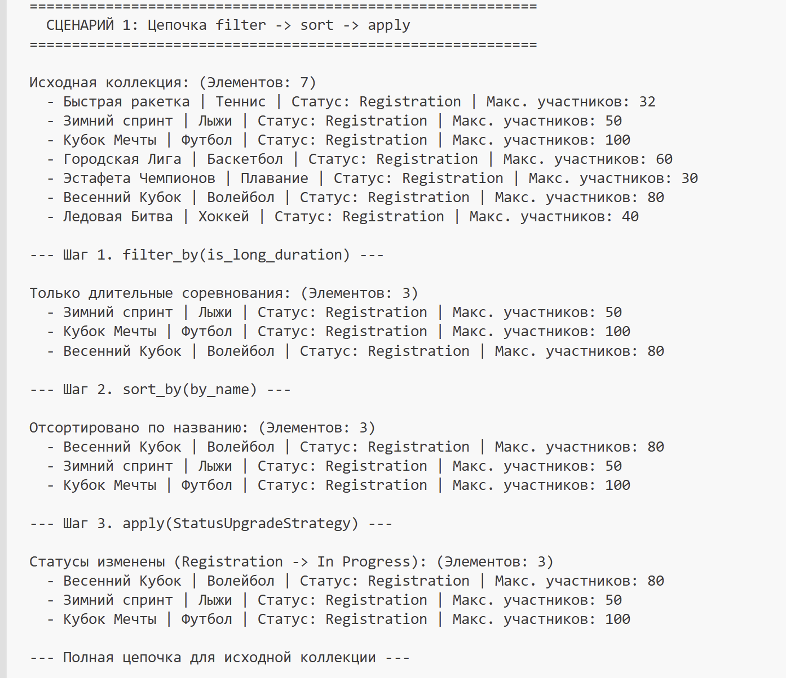
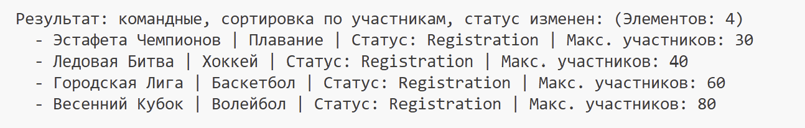
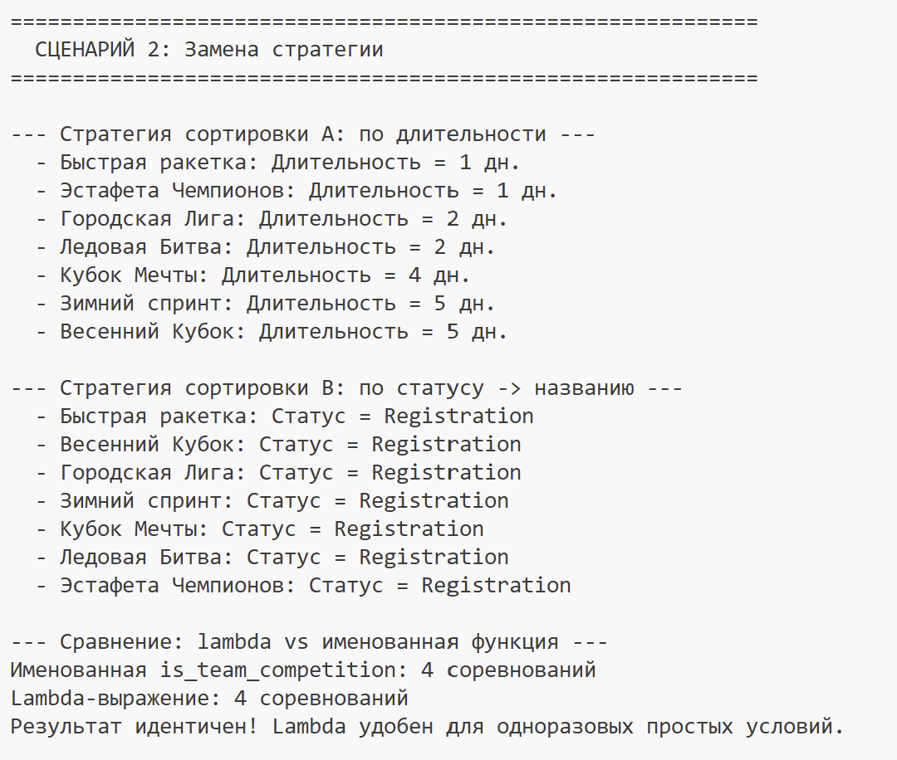
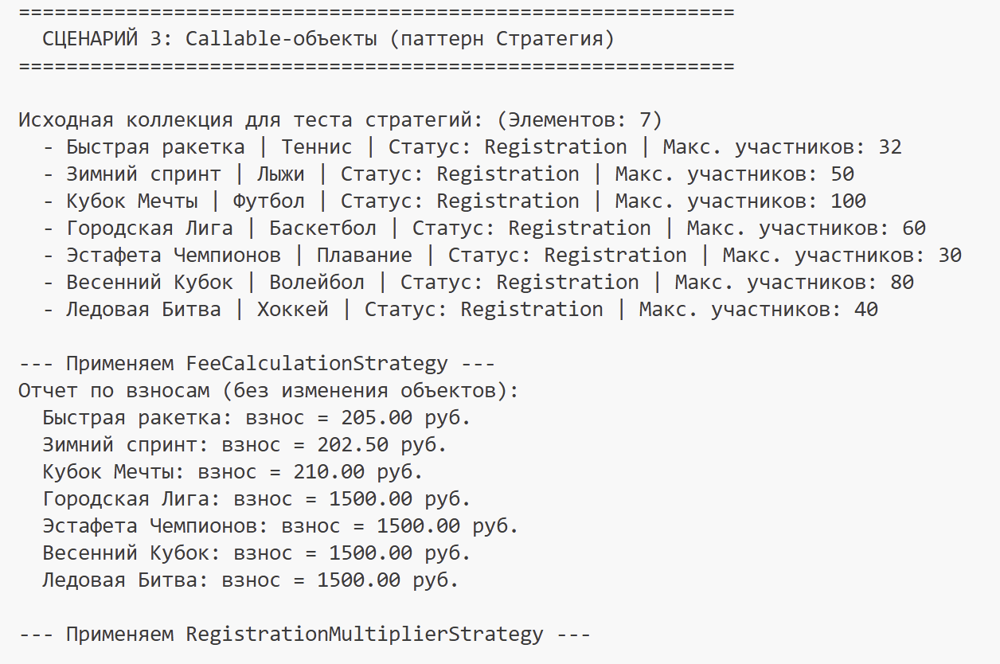
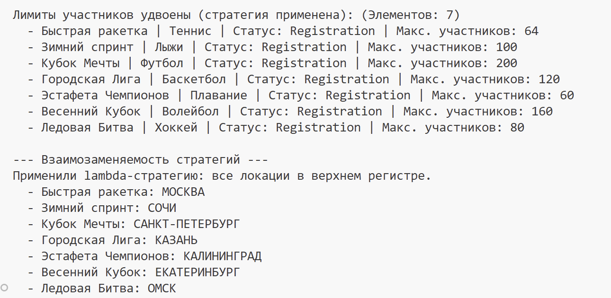

# Лабораторная работа №5 — Функции как аргументы. Стратегии и делегаты

## 1. Цель работы

Освоить передачу функций как аргументов в другие функции и методы. Научиться применять встроенные функции высшего порядка: `map`, `filter`, `sorted`. Понять концепцию паттерна «Стратегия» и реализовать его на Python. Освоить lambda-выражения и их практическое применение. Интегрировать функциональный стиль с объектно-ориентированным кодом из предыдущих лабораторных работ.

## 2. Реализованные функции и стратегии

### Функции-стратегии сортировки (файл `strategies.py`)

| Функция | Описание |
|---------|----------|
| `by_name(comp)` | Сортировка по названию соревнования (алфавитный порядок) |
| `by_max_participants(comp)` | Сортировка по максимальному количеству участников (по возрастанию) |
| `by_duration(comp)` | Сортировка по длительности соревнования в днях (по возрастанию) |
| `by_status_and_name(comp)` | Комбинированная сортировка: сначала по статусу (Registration → In Progress → Completed → Cancelled), затем по названию |

### Функции-фильтры (файл `strategies.py`)

| Функция | Описание |
|---------|----------|
| `is_long_duration(comp)` | Отбирает соревнования длительностью более 2 дней |
| `is_team_competition(comp)` | Отбирает только командные соревнования (проверка через `isinstance`) |

### Фабрики функций (файл `strategies.py`)

| Фабрика | Описание |
|---------|----------|
| `make_participants_filter(min_participants)` | Создаёт функцию-фильтр по минимальному количеству участников. Демонстрирует замыкание |
| `make_status_transition(new_status)` | Создаёт функцию для перевода соревнования в следующий статус |

### Функции преобразования для map() (файл `strategies.py`)

| Функция | Описание |
|---------|----------|
| `to_summary(comp)` | Преобразует объект в краткую строку-сводку: "Название (вид спорта) — Статус" |
| `extract_location(comp)` | Извлекает место проведения соревнования |

### Паттерн «Стратегия» — Callable-объекты (файл `strategies.py`)

| Класс-стратегия | Описание |
|-----------------|----------|
| `StatusUpgradeStrategy` | Переводит соревнование в следующий статус. Callable-объект, взаимозаменяемый с другими стратегиями |
| `FeeCalculationStrategy` | Рассчитывает организационный взнос для каждого соревнования и возвращает строку-отчёт |
| `RegistrationMultiplierStrategy` | Увеличивает лимит участников в 2 раза. Демонстрирует альтернативную стратегию изменения атрибутов |

### Методы коллекции (файл `collection.py`)

| Метод | Описание |
|-------|----------|
| `sort_by(key_func)` | Сортирует коллекцию, принимая функцию-ключ. Возвращает `self` для цепочки вызовов |
| `filter_by(predicate)` | Фильтрует коллекцию, возвращая НОВУЮ коллекцию. Принимает функцию-предикат |
| `apply(func)` | Применяет функцию ко всем элементам коллекции. Поддерживает callable-объекты и lambda. Возвращает `self` для цепочки вызовов |

## 3. Демонстрация работы

### Сценарий 1: Полная цепочка filter → sort → apply

Демонстрируется последовательное применение операций к коллекции из 7 соревнований (3 индивидуальных, 4 командных):

1. **filter_by(is_long_duration)** — оставляем только соревнования длительностью > 2 дней
2. **sort_by(by_name)** — сортируем отфильтрованные по алфавиту
3. **apply(StatusUpgradeStrategy)** — переводим все соревнования в следующий статус

Также показана полная цепочка в одной инструкции: фильтрация командных соревнований → сортировка по участникам → смена статуса.

### Сценарий 2: Замена стратегии без изменения кода коллекции

Показано, как одна и та же коллекция сортируется двумя разными стратегиями:

- **Стратегия A** (`by_duration`) — сортировка по длительности
- **Стратегия B** (`by_status_and_name`) — сортировка по статусу, затем по названию

Также демонстрируется идентичность результатов именованной функции `is_team_competition` и эквивалентного lambda-выражения.

### Сценарий 3: Демонстрация callable-объекта как стратегии

Показана работа трёх взаимозаменяемых стратегий:

1. **FeeCalculationStrategy** — расчёт взносов без изменения объектов
2. **RegistrationMultiplierStrategy** — удвоение лимита участников
3. **Lambda-стратегия** — перевод локаций в верхний регистр (демонстрация, что lambda может выступать как легковесная стратегия)

