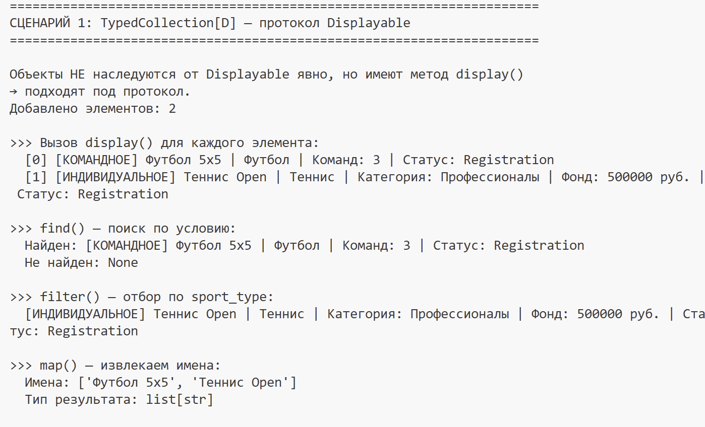
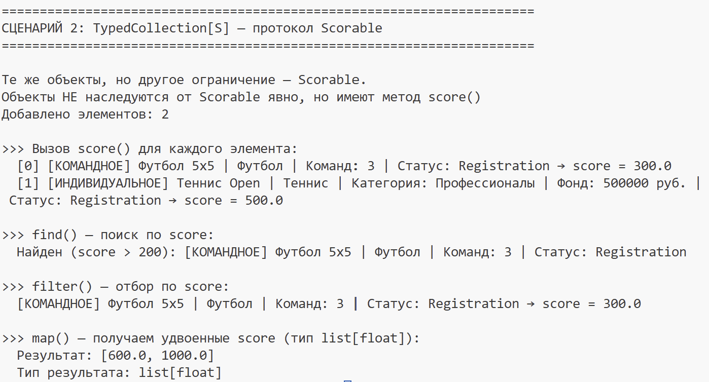

# ЛР-6: Generics и typing

## 1. Цель работы

-Освоить систему аннотаций типов в Python (typing).
-Научиться создавать обобщённые (generic) классы с помощью TypeVar и Generic.
-Понять концепцию структурной типизации через typing.Protocol.

## 2. Описание реализованных типов

### Generic-класс TypedCollection[T]
Обобщённая коллекция с методами:
- `add`, `remove`, `get_all`
- `find(predicate)` — поиск первого подходящего
- `filter(predicate)` — отбор по условию
- `map(transform)` — преобразование с изменением типа

### TypeVar
- `T` — основной параметр типа
- `R` — для map (изменение типа результата)
- `D = TypeVar('D', bound=Displayable)` — только объекты с `display()`
- `S = TypeVar('S', bound=Scorable)` — только объекты с `score()`

### Протоколы
- **Displayable** — требует метод `display() -> str`
- **Scorable** — требует метод `score() -> float`

## 3. Демонстрация работы

### Сценарий 1: TypedCollection[D] — Displayable

- Созданы `TeamCompetition` и `IndividualCompetition`
- Добавлены в коллекцию без наследования от Displayable
- Вызван `display()` у каждого — работает
- Показаны `find`, `filter`, `map`

### Сценарий 2: TypedCollection[S] — Scorable

- Те же объекты добавлены в коллекцию с ограничением Scorable
- Вызван `score()` у каждого — работает
- Один класс TypedCollection работает с разными Protocol