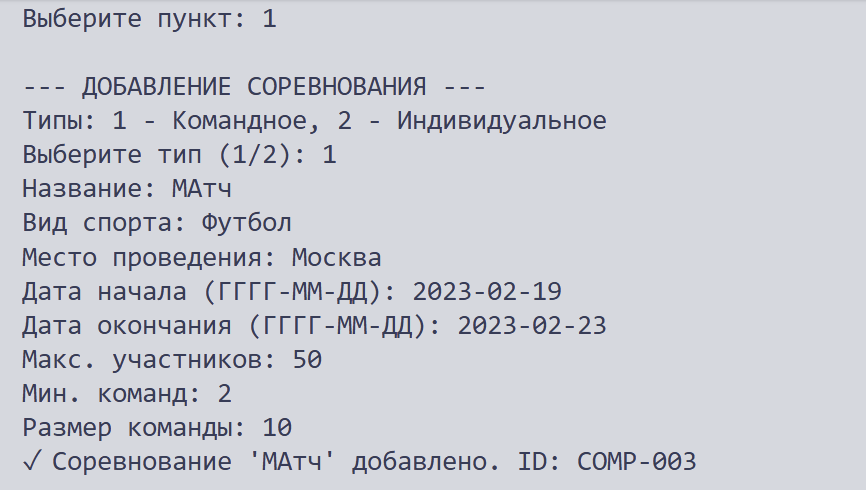
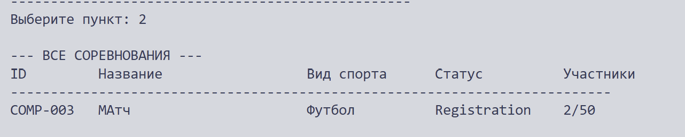

# Лабораторная работа №7

⭐⭐⭐⭐⭐⭐⭐⭐⭐⭐⭐⭐⭐⭐⭐⭐⭐⭐⭐⭐⭐⭐⭐⭐⭐⭐⭐⭐⭐⭐⭐⭐⭐⭐⭐⭐⭐⭐⭐⭐⭐ 


[](https://asciinema.org/a/v2Kh5cCkZutcS11w)


⭐⭐⭐⭐⭐⭐⭐⭐⭐⭐⭐⭐⭐⭐⭐⭐⭐⭐⭐⭐⭐⭐⭐⭐⭐⭐⭐⭐⭐⭐⭐⭐⭐⭐⭐⭐⭐⭐⭐⭐⭐

# 1. Цель работы

Объединить все знания, полученные в ЛР1–ЛР6, в единое работающее приложение. Реализовать интерактивный CLI-интерфейс для управления соревнованиями.


# 2. Структура проекта

```text
python_labs/
│
├─ laba_07/
│  │
│  ├─ README.md
│  ├─ main.py                   # Точка входа, запуск приложения
│  ├─ cli.py                    # Интерфейс: меню, ввод, вывод
│  ├─ app.py                    # Бизнес-логика приложения
│  ├─ models.py                 # Классы соревнований
│  ├─ exceptions.py             # Пользовательские исключения
│  └─ storage.py                # Сохранение/загрузка JSON
```


# 3. Описание CLI

## 3.1 Пункты меню

| Пункт | Описание                  |
| ----- | ------------------------- |
| 1     | Добавить соревнование     |
| 2     | Показать все соревнования |
| 3     | Найти соревнование по ID  |
| 4     | Удалить соревнование      |
| 5     | Фильтрация и поиск        |
| 6     | Сортировка                |
| 0     | Выход (автосохранение)    |


## 3.2 Добавление соревнования

Поддерживаются два типа соревнований:

### Командное соревнование

Пользователь вводит:

* название
* вид спорта
* место проведения
* даты
* максимальное количество участников
* минимальное количество команд
* размер команды

### Индивидуальное соревнование

Пользователь вводит:

* название
* вид спорта
* место проведения
* даты
* максимальное количество участников
* категорию
* призовой фонд


## 3.3 Фильтрация

Доступны следующие фильтры:

| Фильтр          | Описание                             |
| --------------- | ------------------------------------ |
| По виду спорта  | Например: футбол, теннис             |
| По статусу      | Registration, In Progress, Completed |
| По длительности | Диапазон количества дней             |


## 3.4 Сортировка

Поддерживается сортировка:

| Тип сортировки           | Описание                 |
| ------------------------ | ------------------------ |
| По названию              | Алфавитная сортировка    |
| По дате начала           | От ранней даты к поздней |
| По количеству участников | По max_participants      |
| По длительности          | По количеству дней       |

Пользователь может выбрать:

* сортировку по возрастанию
* сортировку по убыванию

# 4. Демонстрация работы

## Сценарий 1: Добавление соревнования





### Что демонстрируется:

Создание нового соревнования с выбором типа и вводом параметров.


## Сценарий 2: Просмотр всех соревнований



### Что демонстрируется:

Вывод всех соревнований в виде форматированной таблицы.


## Сценарий 3: Поиск соревнования


### Что демонстрируется:

Поиск соревнования по ID.

Выводится полная информация о соревновании.

## Сценарий 4: Удаление соревнования


### Что демонстрируется:

Удаление соревнования с подтверждением действия (y/n).

## Сценарий 5: Фильтрация по виду спорта


### Что демонстрируется:

Поиск всех соревнований определённого вида спорта.


## Сценарий 6: Фильтрация 


### Что демонстрируется:

Вывод соревнований с выбранной характеристикой.


# 5. Вывод

В ходе выполнения лабораторной работы были изучены и применены следующие технологии и концепции.


## 5.1 CLI-интерфейс

Реализовано полноценное консольное приложение с интерактивным меню.

Поддерживаются:

* добавление
* удаление
* поиск
* фильтрация
* сортировка
* просмотр данных


## 5.2 Аннотации типов

Во всех функциях используются type hints:

```python
def _perform_sort(self, choice: int, reverse: bool) -> None:
```

Это улучшает читаемость и упрощает поддержку кода.


## 5.3 Исключения

Исключение	Описание
AppError	Базовое исключение приложения
ItemNotFoundError	Объект не найден
DuplicateItemError	Попытка добавить дубликат
StorageError	Ошибка сохранения или загрузки данных

## 5.4 Работа с JSON

Реализованы:

* сохранение данных
* загрузка данных
* автоматическое создание файла и папки


## 5.5 Практическая польза

Разработанное приложение демонстрирует:

* применение ООП
* работу с коллекциями
* обработку ошибок
* работу с файлами
* сериализацию JSON
* построение CLI-приложений
* реализацию CRUD-операций
* использование функций высшего порядка
* применение аннотаций типов
