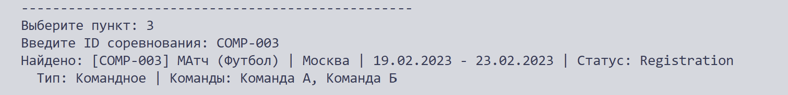
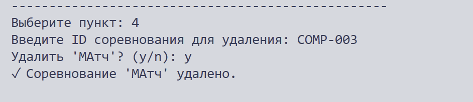
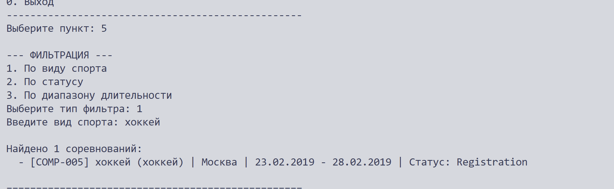
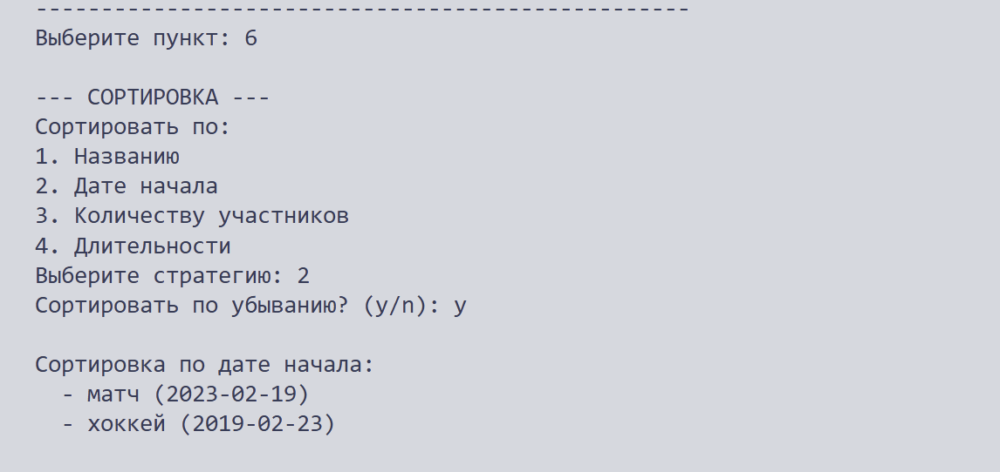

# Лабораторная работа №7 — Консольное приложение «Соревнования»

## 1. Цель работы

Объединить все знания, полученные в ЛР1–ЛР6, в единое работающее приложение. Реализовать интерактивный CLI-интерфейс с меню и вводом пользователя.

### Применённые навыки:

- **Объектно-ориентированное программирование** (классы `Competition`, `TeamCompetition`, `IndividualCompetition`)
- **Наследование и полиморфизм** (иерархия соревнований, переопределение методов `calculate_organizer_fee()`, `next_status()`)
- **Интерфейсы** (`Printable`, `Comparable`)
- **Работа с коллекциями** (`CompetitionCollection`)
- **Собственные исключения** (`ItemNotFoundError`, `DuplicateItemError`)
- **Функции высшего порядка** (сортировка через `lambda`, фильтрация через предикаты)
- **Аннотации типов** (`typing`, `TypeVar`, `Generic`, `Protocol`)
- **Работа с JSON** (сохранение/загрузка данных)
- **Разделение на слои** (CLI → бизнес-логика → хранение данных)

---

## 2. Структура проекта
python_labs/
├── src/
│ ├── lab01/ # Валидация и базовая модель Competition
│ ├── lab02/ # Коллекция CompetitionCollection
│ ├── lab03/ # Наследование (TeamCompetition, IndividualCompetition)
│ ├── lab04/ # Интерфейсы (Printable, Comparable)
│ ├── lab05/ # Стратегии сортировки и фильтрации
│ ├── lab06/ # Generics и TypedCollection
│ └── lab07/
│ ├── data/
│ │ └── competitions.json # Файл с сохранёнными соревнованиями
│ ├── README.md # Документация (этот файл)
│ ├── main.py # Точка входа, запуск приложения
│ ├── cli.py # Интерфейс: меню, ввод, вывод
│ ├── app.py # Бизнес-логика (управление данными)
│ ├── models.py # Классы соревнований
│ ├── exceptions.py # Пользовательские исключения
│ └── storage.py # Сохранение/загрузка данных в JSON
└── images/
└── lab07/ # Скриншоты работы приложения

text

---

## 3. Описание CLI

### 3.1 Пункты меню

| Пункт | Описание |
|-------|----------|
| 1 | Добавить соревнование (командное или индивидуальное) |
| 2 | Показать все соревнования (таблица) |
| 3 | Найти соревнование по ID |
| 4 | Удалить соревнование (с подтверждением `y/n`) |
| 5 | Фильтрация (по виду спорта, статусу, диапазону длительности) |
| 6 | Сортировка (по названию, дате, участникам, длительности) |
| 0 | Выход (автосохранение) |

### 3.2 Обработка ошибок ввода

| Ошибка | Сообщение |
|--------|-----------|
| Неверный пункт меню | `Неверный пункт меню. Попробуйте снова.` |
| Ввод строки вместо числа | `Ошибка: введите число` |
| Пустое название | `Ошибка: Название соревнования не может быть пустым` |
| Некорректные даты | `Ошибка: Дата окончания должна быть позже даты начала` |
| Добавление дубликата | `✗ Ошибка: Соревнование с таким ID уже существует` |
| Удаление несуществующего | `Соревнование с ID {id} не найдено` |

### 3.3 Сохранение/загрузка данных

- **При запуске**: автоматическая загрузка из `data/competitions.json`
- **При выходе**: автоматическое сохранение в `data/competitions.json`
- Папка `data` и файл создаются автоматически при первом сохранении
- **Формат данных**: JSON (сохраняется тип, название, вид спорта, локация, даты, статус, ID)

---

## 4. Демонстрация работы

### Сценарий 1: Запуск → автозагрузка данных

### Сценарий 2: Добавление соревнования

### Сценарий 3: Просмотр всех соревнований

### Сценарий 4: Поиск соревнования

### Сценарий 5: Удаление с подтверждением

### Сценарий 6: Фильтрация

